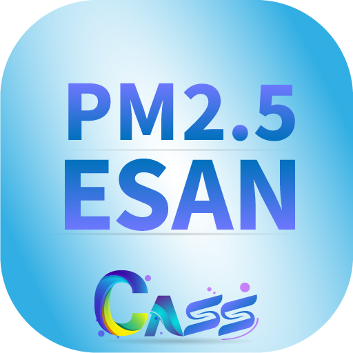

# ฝุ่น PM2.5 ภาคอีสาน (The PM2.5ESAN)

 

## Download the Application

- [Download for iOS](https://apps.apple.com/th/app/%E0%B8%9D-%E0%B8%99-pm2-5-%E0%B8%A0%E0%B8%B2%E0%B8%84%E0%B8%AD-%E0%B8%B5%E0%B8%AA%E0%B8%B2%E0%B8%99/id6480331074)
- [Download for Android](https://play.google.com/store/apps/details?id=com.billowdev.pm_air_pollution_north_east_thailand&pcampaignid=web_share)

## About the Application

The development of the **ฝุ่น PM2.5 ภาคอีสาน** (ESAN Air Sync) mobile application is part of the research project "Development of PM2.5 Dispersion Models in Vertical and Horizontal Directions Using Satellite Data and Ground Data in the Northeastern Region of Thailand to Assess the Risk of Respiratory Diseases." This project is funded by Sakon Nakhon Rajabhat University.

This application will display the concentration of PM2.5 particles and the altitude level of PM2.5 particles in the atmosphere. It will send notification messages to users' mobile phones when the concentration of PM2.5 particles exceeds the standard value. This will lead to an assessment of the risk of respiratory diseases, providing guidance on preventing risks associated with PM2.5 particles.

## Scan to Download

---

**Kannikar Kamolrat**. All rights reserved 2024.
